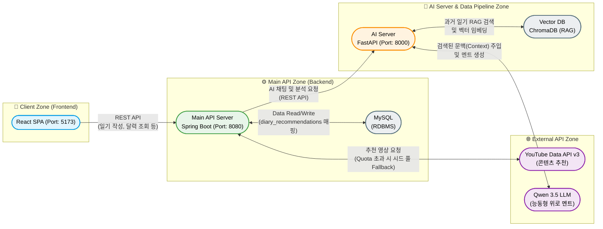

# 🌼 Freesia (프리지아) : 내 마음을 알아주는 AI 감정 일기장

> "당신의 하루에 피어나는 따뜻한 위로"  
> AI 기반 감정 분석, 능동형 공감 챗봇 및 5종 맞춤 힐링 콘텐츠(음악·영화·도서·취미·활동) 다이어리 서비스

<br/>

## 💡 프로젝트 기획 배경 및 목표

바쁘고 지친 현대인들이 일기를 쓰며 하루를 돌아볼 때, 프리지아 꽃의 꽃말인 **'당신의 시작을 응원합니다'**처럼 따뜻한 색감과 AI의 다정한 피드백을 통해 심리적 안정감을 제공하고자 기획했습니다.  
단순한 '명령-응답' 형태를 넘어, **사용자의 과거 기록을 기억하고 먼저 안부를 물어보는 능동형 AI 비서**와 **감정 분석 기반 5종 맞춤형 힐링 콘텐츠 큐레이션 시스템**을 결합한 멘탈 케어 다이어리를 제공합니다.

<br/>

## 📸 서비스 화면 (Preview)

<p align="center">
  
  
  
</p>

<br/>

## 🛠 기술 스택 (Tech Stack)

### Frontend
- **Framework:** React 18, TypeScript, Vite
- **Styling:** CSS3, Vanilla CSS Animations
- **State & Storage:** React Hooks, LocalStorage 영속화, React Router

### Backend (Main API)
- **Framework:** Java 17, Spring Boot 3.x, Spring Data JPA
- **Database:** MySQL 8.0
- **Auth:** JWT (JSON Web Token), Spring Security

### AI Server & Data Pipeline
- **Framework:** Python, FastAPI, Uvicorn
- **Vector DB:** ChromaDB (RAG 기억 저장소)
- **AI Model:** Qwen/Qwen3.5-35B-A3B-FP8 (LLM API), KR-SBERT (Sentence Transformer)
- **ML/Data:** Scikit-learn, MLflow, Pandas (감정 분류 모델)

### Infra & Tools
- **Deployment:** Docker, Docker Compose, Nginx
- **API & Tools:** YouTube Data API v3, Postman, MySQL Workbench
- **AI-Assisted Dev:** LLM 기반 바이브 코딩(Vibe Coding)

<br/>

## 🏗 시스템 아키텍처 및 디렉토리 구조

### System Architecture
```text
Client (React, 5173) 
  ↔ Main API Server (Spring Boot, 8080) 
  ↔ AI Server (FastAPI, 8000) 
      ↳ [RAG Pipeline] ↔ Vector DB (ChromaDB)
  ↔ External API (Qwen 3.5 LLM / YouTube Data API v3)
```

```text
FREESIA-FINAL/
├── 📁 frontend/ (React SPA)
│   ├── src/ (api, assets, components, pages)
│   ├── Dockerfile
│   └── nginx.conf
├── 📁 backend/ (Spring Boot REST API)
│   ├── src/main/java/com/freesia/backend
│   │   ├── analysis/       # AI 서버 통신 도메인
│   │   ├── chat/           # 채팅 로직
│   │   ├── diary/          # 일기 및 감정 처리, 일기-추천 N:M 매핑
│   │   ├── member/         # 회원 및 JWT 인증
│   │   └── recommendation/ # 콘텐츠 크롤링, Fallback 시드 풀 및 추천 스케줄러
│   └── Dockerfile
└── 📁 ai-server/ (FastAPI & ML Pipeline)
    ├── data/               # 말뭉치 데이터 전처리 파이프라인
    ├── training/           # MLflow 기반 감정 분류 모델 학습
    ├── app.py              # FastAPI 엔드포인트 및 LLM 프롬프트 주입
    └── rag_service.py      # ChromaDB 벡터 검색 모듈
```




<br> * MySQL Workbench를 활용하여 설계한 Freesia 서비스의 데이터베이스 ERD (일기-추천 다대다 매핑 테이블 포함)

<br/>

## ✨ 핵심 기능 (Key Features)

1. **RAG 기반 능동형 공감 챗봇:** 사용자의 과거 일기를 벡터 검색하여 시스템 프롬프트에 동적 주입, 과거를 기억하고 먼저 안부를 묻는 인간적인 공감형 대화 구현.
2. **인터랙티브 감정 달력 & 통계 대시보드:** 날짜별 감정 시각화와 Canvas 기반 월별 감정 분포 그래프를 통해 감정 변화 추이를 직관적으로 제공.
3. **5종 맞춤 힐링 콘텐츠 큐레이션 (음악·영화·도서·취미·활동):** 분석된 감정에 어울리는 다양한 카테고리의 콘텐츠를 추천하며, 팝업 내 실시간 재추천(`[🔄 다른 콘텐츠 추천받기]`) 지원.
4. **일기별 추천 콘텐츠 영구 결속 (데이터 불변성):** 일기 작성 시 추천된 콘텐츠를 N:M 연관관계(`diary_recommendations`)로 영구 보존하여, 캘린더에서 지난 일기 조회 시 작성 당시의 추천 데이터가 고정 유지.
5. **사용자 피드백 루프 (👍 찜 & 👎 다시 보지 않기):** 카드별 찜 토글 및 비추천 피드백을 브라우저 스토리지와 백엔드 API에 영구 보존하여 개인화 추천 강화.
6. **일기 중복 작성 방지 및 재작성 플로우:** 작성 완료 시 입력창을 잠그고, `[AI 가 추천 콘텐츠 보기]` 옆에 `[✏️ 다시 작성하기]` 버튼을 제공하여 데이터 중복 생성 방어.

<br/>

## 🔥 핵심 트러블 슈팅 (Troubleshooting)

이 프로젝트는 단순 API 연동을 넘어 개발 과정에서 마주한 **구조적 한계, 외부 API 장애, 데이터 정합성 버그를 논리적으로 분석하고 해결하는 과정**에 집중했습니다.

### 1. [AI/RAG] 벡터 검색의 한계와 시간 기반 필터링 도입
- **문제:** "오늘 하루 어땠어?" 같은 모호한 질문 입력 시, 단순 코사인 유사도 기반 Vector DB 검색으로는 엉뚱한 과거 데이터를 가져와 맥락이 단절되는 현상 발생.
- **해결:** 일기장 도메인의 핵심인 '시간적 맥락'을 부여하기 위해 메타데이터(`date`) 필터링과 **최신순 정렬(Recency Sorting)** 로직을 결합하여 인간의 회상 구조를 모방했습니다.

```python
# ai-server/rag_service.py 일부
def search_similar_diaries(query_text: str, top_k: int = 3) -> list:
    target_date = _extract_date_filter(query_text)
    where_clause = {"date": target_date} if target_date else None
    
    similar_diaries.sort(key=lambda x: x["date"], reverse=True)
    return similar_diaries
```

### 2. [Backend] 한국 표준시(KST) 불일치 및 서버 주도형 시간 관리
- **문제:** 새벽 시간대(00:00~09:00)에 일기 작성 시 브라우저 런타임 환경에 따라 DB에 하루 전날(UTC)로 저장되는 데이터 무결성 붕괴 발생.
- **해결:** 클라이언트 전송 시간을 무조건 신뢰하는 대신, Spring Boot 엔티티 생명주기 콜백(`@PrePersist`)을 활용하여 서버 단에서 KST(`Asia/Seoul`) 시간을 강제 오버라이트하도록 아키텍처를 변경했습니다.

```java
// backend/.../diary/entity/Diary.java 일부
@PrePersist
public void prePersist() {
    this.date = LocalDate.now(ZoneId.of("Asia/Seoul")); 
}
```

### 3. [Data] 추천 콘텐츠 시드 중복 및 무한 반복 현상
- **문제:** 추천 API 호출 시 `System.nanoTime()` 기반 Random 시드의 실행 속도가 너무 빨라 루프 내에서 동일한 시드값이 적용되어 같은 콘텐츠만 편향 노출됨.
- **해결:** 매 추출마다 완전히 새로운 인스턴스로 셔플을 보장하고, 사용자의 '싫어요(Feedback)' 데이터를 스트림 필터로 분리하는 개인화 로직을 완성했습니다.

```java
// backend/.../recommendation/service/RecommendationService.java 일부
List<Recommendation> filteredRecommendations = allRecommendations.stream()
        .filter(rec -> !finalDislikedIds.contains(rec.getId()))
        .collect(Collectors.toList());

Collections.shuffle(filteredRecommendations, new Random(System.nanoTime()));
```

### 4. [Frontend] 긴 컨텐츠로 인한 UI 크래시(White Screen) 및 모달 이탈
- **문제:** 일기 본문과 5종 추천 카드가 많아질 경우 뷰포트(Viewport)를 벗어나거나 닫기 버튼이 화면 밖으로 밀려 클릭되지 않는 렌더링 오류 발생.
- **해결:** 화면 전체 스크롤을 막고, 모달 내부 컨테이너에 독립적인 스크롤바(`max-height: 52vh`, `overflow-y: auto`)와 딤드 오버레이를 적용하여 뷰포트 대비 안전한 모달 UI를 구현했습니다.

### 5. [Backend/Infra] YouTube API 할당량 초과(429) 대응 Fallback 아키텍처
- **문제:** YouTube Data API v3의 일일 무료 쿼터(10,000pt) 소진 시 `HTTP 429 Too Many Requests`가 발생하여 추천 시스템 전체가 중단되는 외부 API 종속성 장애 발생.
- **해결:** 장애 허용(Fault-Tolerance) 설계를 적용하여, API Quota 초과 시에도 시스템 중단 없이 즉시 가동되는 **감정별 고품질 시드 풀(Seed Pool 48건)** 자동 적재 파이프라인을 구축했습니다. 또한 Video ID 만료 문제를 방지하기 위해 공식 음원 검색 딥링크(`results?search_query=`) 체계로 전환했습니다.

### 6. [Frontend/State] 일기-추천 데이터 불일치(이중 난수 추첨) 해결 및 N:M 영속화
- **문제:** 일기 저장 시점과 모달 오픈 시점에 추천 API가 각각 따로 호출되면서, 일기에 저장된 추천 콘텐츠와 팝업에 표시되는 콘텐츠가 일치하지 않는 데이터 정합성 결여 발생.
- **해결:** DB에 `diary_recommendations` 다대다(N:M) 매핑 테이블을 신설하여 일기 생성 시 추천 콘텐츠를 영구 결속시켰으며, 프론트엔드에서는 일기 객체에 묶인 추천 데이터를 공유하는 **단일 원천(Single Source of Truth)** 구조로 동기화했습니다.

<br/>

## 🚀 시작하기 (Getting Started)
프로젝트를 로컬 환경에서 실행하는 방법입니다.

```bash
# 1. Repository 클론
$ git clone [https://github.com/Jodongyoung/freesia-capstone.git](https://github.com/Jodongyoung/freesia-capstone.git)
$ cd freesia-capstone

# 2. 로컬 설정 파일 추가 (필수)
# backend/src/main/resources/application.yml DB 정보 설정
# ai-server/.env 생성 후 LLM API Key 설정

# 3. Docker Compose를 활용한 전체 서버 빌드 및 백그라운드 실행
$ docker compose up --build -d
```

<br/>

## 🚀 향후 계획 (Future Plans)

1. **AI 서비스 성능 고도화:** 복합적인 감정(예: 기쁘지만 불안한)을 다중 라벨링(Multi-labeling) 방식으로 정밀 분석하는 파이프라인 도입.
2. **콘텐츠 추천 알고리즘 고도화:** 축적된 사용자 피드백(찜, 다시 보지 않기) 데이터를 바탕으로 협업 필터링(Collaborative Filtering) 기반 추천 강화.
3. **인프라 자동화 (CI/CD):** GitHub Actions와 AWS EC2/S3를 연동하여 코드 푸시 시 자동 테스트 및 무중단 배포가 이루어지는 파이프라인 구축.
